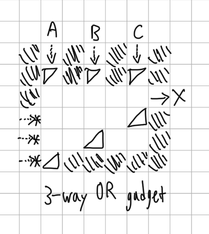
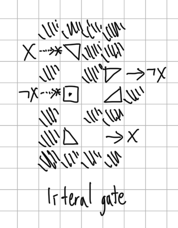
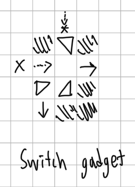
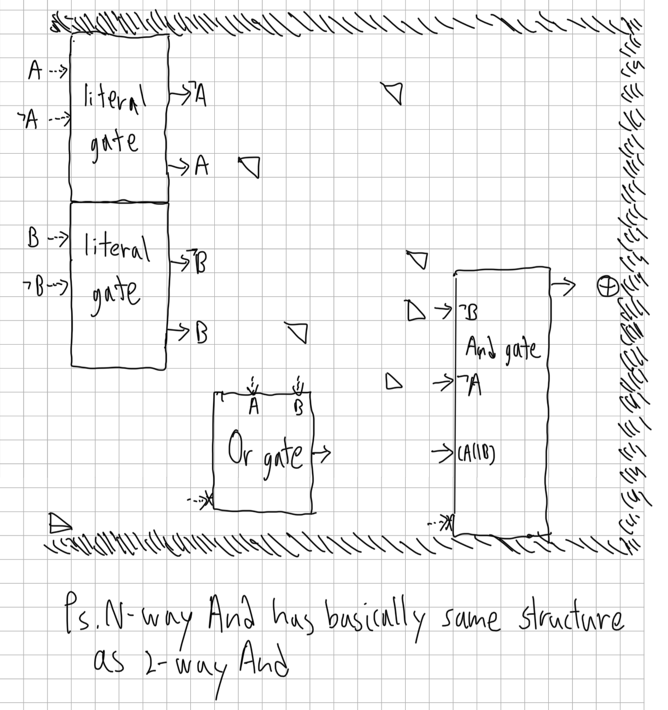
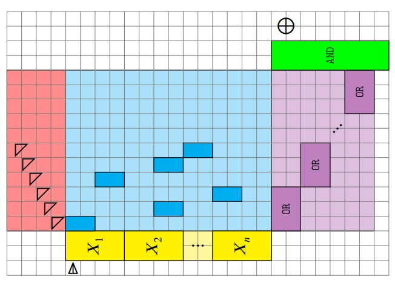
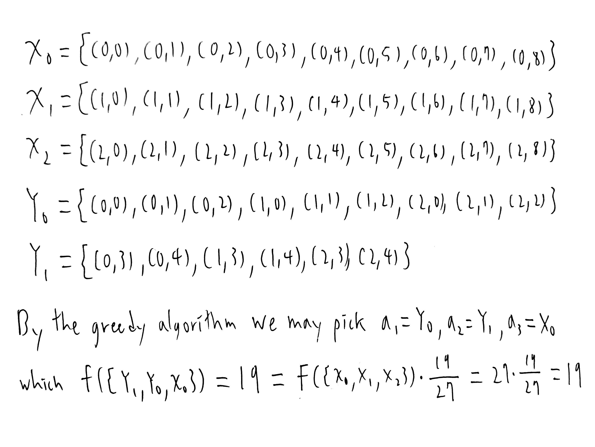

# Homework 4
#### B10902033 林祐辰
<br>
References:<br>
Problem 1: https://arxiv.org/pdf/1908.05966.pdf (paper for laser tank is NPC)<br>
Problem 2: https://cse.buffalo.edu/~shil/courses/CSE632-Fall2017/Notes/lec3.pdf (lecture about set cover)<br>
<br>
Problem 1:<br>
(1)<br><br>
    When either of the inputs A, B or C are available, then X allows for output.<br>
(2)<br><br>
    When we fire once through X first, we will unlock X bar and that it go through the literal gate, similar when we want to unlock X.<br>
(3)<br><br>
    It allows for the input X to be available first as output to the right, then redirected down when we shoot the triangle on the top.
(4)<br><br>
(5) Algorithm:<br>
1. Construct n literal gates for n variables to make X and X bar.<br>
2. Construct u three-way-or gates and 3u switch gates for u clauses.(for each switches we need a triangle mirror to activate)<br>
3. Construct an and gate with u inputs.<br>
4. The goal is set at the output of the and-gate.<br>
A 3-CNF problem can be converted to a LaserTank puzzle in polynomial time since the board size is a polynomial in the number of variables and clauses.<br>
Illustration:<br>
<br>
(6) Algorithm 1:(3-CNF-SAT aolution to puzzle solution)<br>
1. For the variables with true value in 3-CNF-SAT solution we fire once to it's bar in literal gate, and for those with false value we fire once to it's unbar.<br>
2. Turn on the switches from top to down to iterate through all the clauses, for each clauses shoot the variables in each clause then shoot the or-gate for that clause.<br>
3. Finally shoot the and-gate then we can get the goal.<br>
Algorithm 2:(puzzle solution to 3-CNF-SAT solution)<br>
1. From the puzzle solution we can trace back to get which variable we set to true.<br>
2. And for those variable that didn't be set we simply set it true for 3-CNF-SAT solution.<br>
Problem 2:<br>
(a) Algorithm:<br>

```C
indicies = {}
visited[M] = {0}
for i = 0 to K-1:   //O(K)
    max_val = 0
    max_id = 0
    for j = 0 to M-1:   //O(M)
        if(visited[j]):
            continue
        indicies.push_back(j)
        tmp = f(indicies)   //O(NK)
        indicies.pop_back(j)
        if(tmp > max_val):
            max_val = tmp
            max_id = j
    indicies.push_back(max_id)
    visited[max_id] = 1    
```
Time complexity: O(K * M * NK) = O(NMK^2)
<br>
(b)<br>
(c)